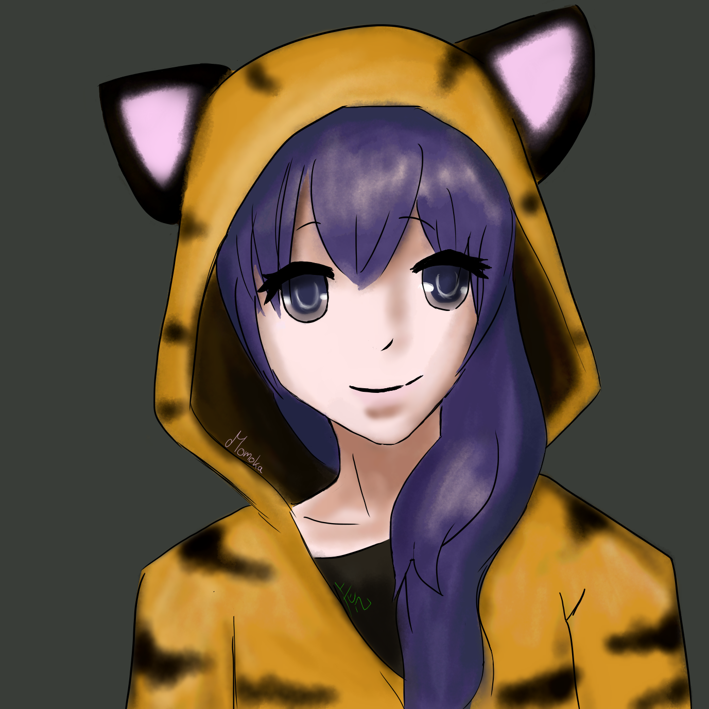

# Welcome to Discomoka 3!
Discomoka 3 is (yet another) Discord Bot which serves you Music and other fun stuff.

Discomoka is the spiritual successor to Momoka, a TeamSpeak music bot I developed a few years ago with the same core feature: playing & managing music.
The name "Discomoka" is a combination of Discord and Momoka.

_Portrait of Momoka (drawn by [TheoreticalTora](http://exploratora.tumblr.com/))_

## How to add Discomoka to your server
To add Discomoka to your own Discord server, use the following link: [rgunti.li/discomoka3](http://rgunti.li/discomoka3join)

## How to run my own instance of Discomoka
If you prefer to run Discomoka on your own hardware (which you are very welcome to do so), follow the [self-hosting tutorial](self-host.md).

