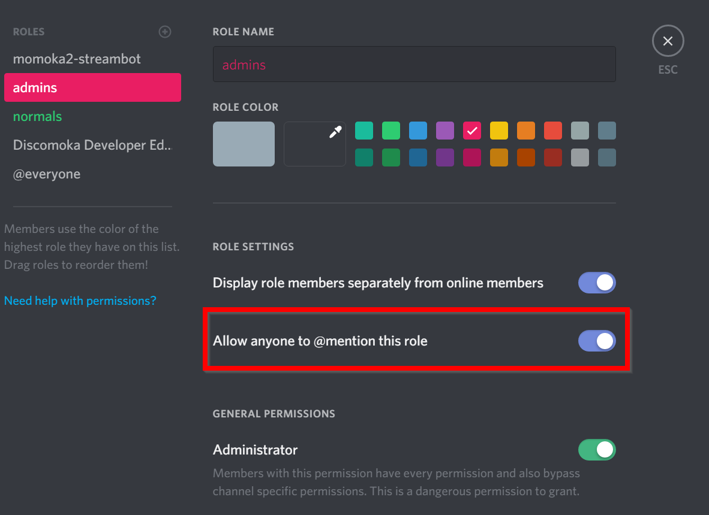

# `rolesetup`

Sets up Permissions for the server. This command should be executed once the Bot joins the server. The command can only be executed by the server owner. (Usable only in servers)

|                          |                                                                                                          |
| ------------------------ | -------------------------------------------------------------------------------------------------------- |
| **Command Group**        | setup                                                                                                    |
| **Aliases**              | none                                                                                                     |
| **Syntax**               | `> rolesetup`<br>`> rolesetup <Admin Role> <Moderator Role> <Supporter Role> <Member Role> <Guest Role>` |
| **Required Permission**  | -                                                                                                        |
| **Special Requirements** | can only be run by the server owner                                                                      |

## Arguments
| Argument       | Type | Description                                               | Default Value |
| -------------- | ---- | --------------------------------------------------------- | ------------- |
| Admin Role     | Role | Role for Server Administrators (owner, co-owners, admins) | -             |
| Moderator Role | Role | Role for Moderators                                       | -             |
| Supporter Role | Role | Role for Supporters ("sub-moderators")                    | -             |
| Member Role    | Role | Role for normal members allowed to use this bot           | -             |
| Guest Role     | Role | Role for everyone else (usually @everyone is a good fit)  | -             |

## Examples
```
> rolesetup @admins @moderators @supporters @members @everyone
```

## Notes
You will need to enable everyone to mention roles temporarly. To do this, enter your servers role configuration and enable "Allow everyone to @mention this role". After running this command, you can disable it again.

